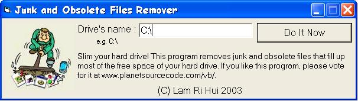

## Junk and Obsolete Files Remover

### Description

Slim your harddisk! Most of your Windows applications temporarily create several files on your hard drive when they

are running. These files are supposed to be removed and the space recovered after these programs are closed. Often,

however, they don’t because of a program error, sloppy architecture, your system is reset or not shut down properly, or

if another application locks up or crashes. Any file that is left behind in this manner will remain on your system unless

you manually search for it and remove it. Over time, these junk and obsolete files can accumulate to megabytes of wasted

hard drive space, as well as turn into potential error-producing cross-linked drive references.Junk and Obsolete Files

Remover targets these specific types of files which are missed by common disk utilities, un-install, "Defrag", "Scandisk", and other standard "cleaner" type programs. Leave comments and put some globes for this program.
 
### More Info
 

             |
---                |---
**Submitted On**   |2003-10-23 02:11:02
**By**             |[Lam Ri Hui](https://github.com/Planet-Source-Code/PSCIndex/blob/master/ByAuthor/lam-ri-hui.md)
**Level**          |Intermediate
**User Rating**    |4.8 (29 globes from 6 users)
**Compatibility**  |VB 4\.0 \(16\-bit\), VB 4\.0 \(32\-bit\), VB 5\.0, VB 6\.0
**Category**       |[Complete Applications](https://github.com/Planet-Source-Code/PSCIndex/blob/master/ByCategory/complete-applications__1-27.md)
**World**          |[Visual Basic](https://github.com/Planet-Source-Code/PSCIndex/blob/master/ByWorld/visual-basic.md)
**Archive File**   |[Junk\_and\_O16623410232003\.zip](https://github.com/Planet-Source-Code/lam-ri-hui-junk-and-obsolete-files-remover__1-49403/archive/master.zip)

